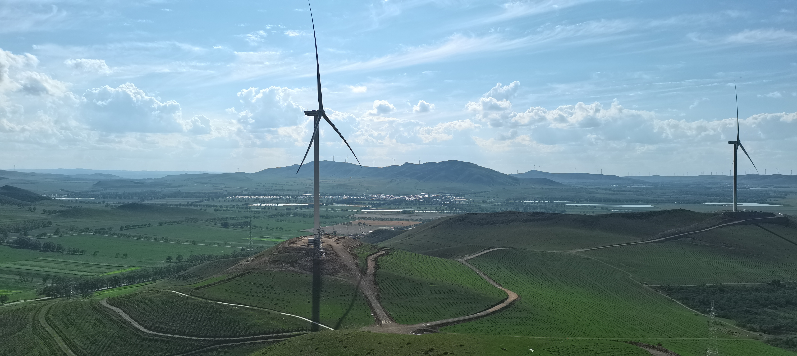
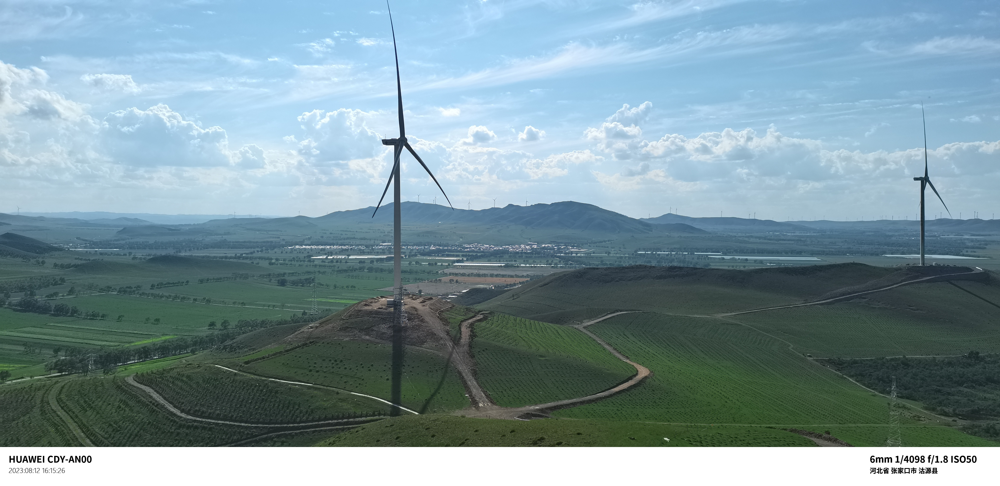

# ExifWatermark
Add  EXIF watermarks (date, camera, lens, GPS location) to your photos

# how to compile
```shell
cmake --preset ExifWatermarker
cmake --build build
cmake --install build --prefix your_path --config Release
```
- go to [baidumap](https://lbsyun.baidu.com/apiconsole/key), apply your access key and corresponding sk, put it in main.cpp
- put your image in your_path, drag the image onto exe, then picture will be generated in current path.
  
# reference


# tips
- chinese characters in path is not allowed
- according to baidumap regulation, any individual is strictly prohibited from transferring, lending the obtained AK or related content developed based on them to any other third party. so release is no longer usable.