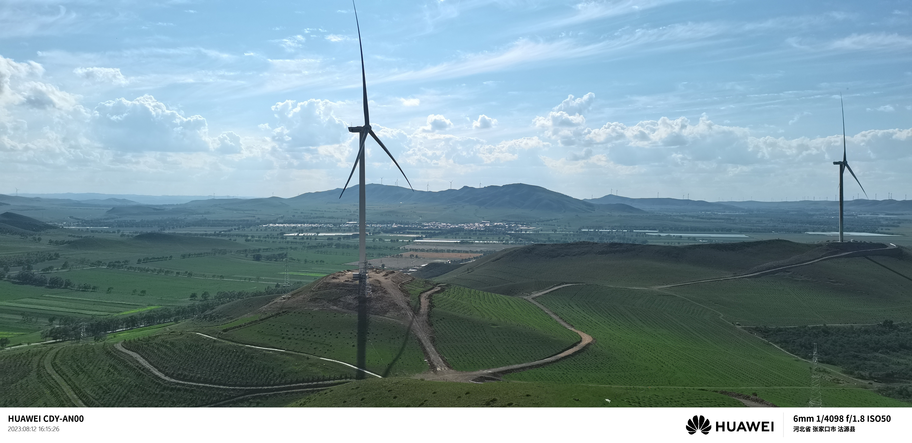

# ExifWatermark
Add  EXIF watermarks (date, camera, lens, GPS location) to your photos

# how to compile
```shell
cmake --preset release
cmake --build --preset release
```
- go to [baidumap](https://lbsyun.baidu.com/apiconsole/key), apply your access key and corresponding sk
- put your image in your_path, drag the image onto exe, then picture will be generated in current path.
- Positional arguments:
  input              image file path [required]

- Optional arguments:
    -h, --help         shows help message and exits 
    -v, --version      prints version information and exits 
    -v, --verbose      enable verbose output 
    --reverse-geocode  enable baidu map reverse geocode 
    --ak               baidu map ak, visit https://lbsyun.baidu.com/apiconsole/key 
    --sk               baidu map sk corresponding to ak
    --add-logo         enable adding camera logo to image 
  
# reference




# tips
- chinese characters in path is not allowed
- according to baidumap regulation, any individual is strictly prohibited from transferring, lending the obtained AK or related content developed based on them to any other third party. so release is no longer usable.