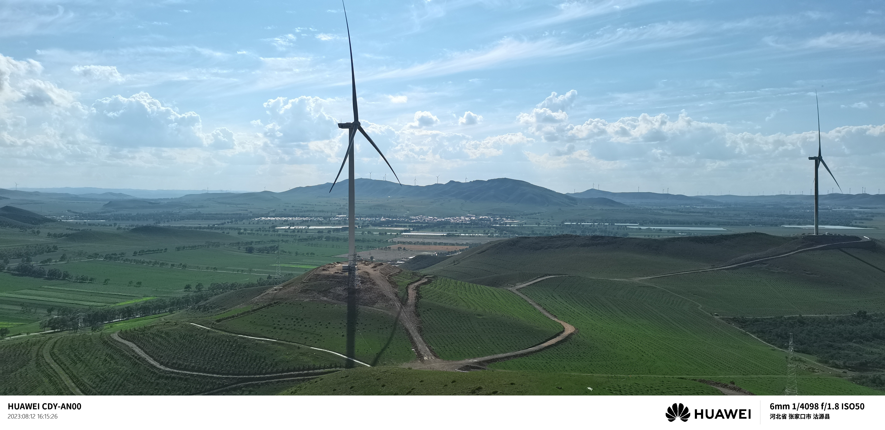
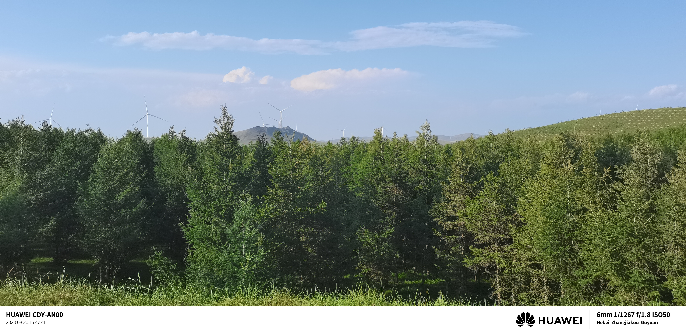

# ExifWatermark
Add  EXIF watermarks (date, camera, lens, GPS location) to your photos

# how to compile
```shell
cmake --preset release
cmake --build --preset release
```
- go to [baidumap](https://lbsyun.baidu.com/apiconsole/key), apply your access key and corresponding sk
- put your image in your_path, drag the image onto exe, then picture will be generated in current path.
- Positional arguments:
  input              image file path [required]

- Optional arguments:
  -h, --help                shows help message and exits  
  -v, --version             prints version information and exits  
  --verbose                 enable verbose output  
  --reverse_geocode_local   enable local reverse geocode using GeoNames data  
  --reverse_geocode_online  enable baidu map reverse geocode  
  --ak                      baidu map ak, visit https://lbsyun.baidu.com/apiconsole/key [nargs=0..1] [default: ""]  
  --sk                      baidu map sk corresponding to ak [nargs=0..1] [default: ""]  
  --add_logo                enable adding camera logo to image  
  
# example 



# tips
- chinese characters in path is not allowed

# Acknowledgements
## base

[exiv2](https://github.com/Exiv2/exiv2.git) - a C++ library and a command-line utility to read, write, delete and modify Exif, IPTC, XMP and ICC image metadata.

[argparse](https://github.com/p-ranav/argparse.git) - header-only argumnets parse library

[CImg](https://github.com/GreycLab/CImg.git) - a small and open-source C++ library for image processing

[openCV](https://github.com/opencv/opencv.git) - powerful Open Source Computer Vision Library

[freetype](https://freetype.org) - for chinese characters render

## online reverse geocode
[nlohmann-json](https://github.com/nlohmann/json.git) - JSON for Modern C++

[curl](https://github.com/curl/curl.git) - a command-line tool for transferring data from or to a server using URLs

[openssl](https://github.com/openssl/openssl.git) - md5 Encryption

## offline reverse geocode
[GeoNames](https://www.geonames.org/) - a global geographical name database project that provides extensive geographic location data, such as countries, provinces, cities, counties, towns, POIs, latitude/longitude coordinates, and administrative division information.  

[GeoNamesCN](https://github.com/CZAsTc/GeoNamesCN.git) - filter place name data for Chinese regions
